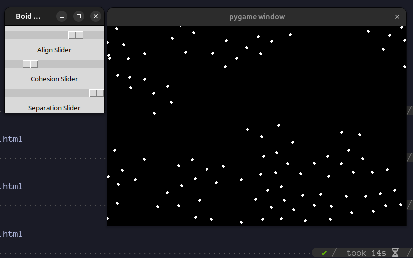

# Flock and Sand

   


# Flock and Sand Simulator

## Overview
The Flock and Sand Simulator is a physics simulation that visualizes flocking behavior and granular sand dynamics. This project demonstrates how simple rules can lead to complex behaviors in natural systems.

## Features
- **Flocking Simulation**: Simulates the movement of agents that follow simple rules to create collective behavior.
- **Sand Simulation**: Models the behavior of granular materials, demonstrating how they interact under various conditions.

## Requirements

- Python 3.x
- Pygame
- Tkinker (for Flocking Simulator)

## Installation
1. Clone the repository:
   ```bash
   git clone https://github.com/bishos123/FlockandSand.git
   ```
3. Create ENV (recommendable):
    ```bash
    python -m venv env
    source env/bin/activate  # Linux/Mac
    .\env\Scripts\activate  # Windows
    ```
4. Install Pygame and Tkinker:
    ```bash
    pip install tk   
    pip install pygame
    ```
5. Tests simulators:
    ```bash
    python 'Floaking Simulator.py' 
    python 'Sand Simulator.py'
    ```
